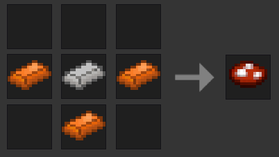
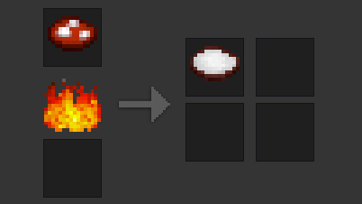
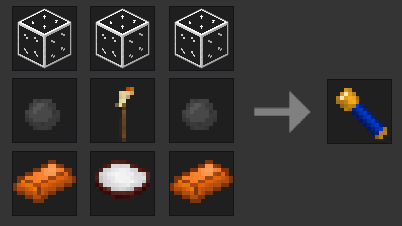
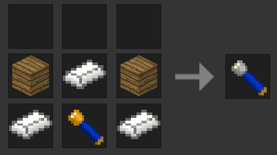
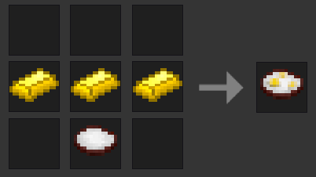
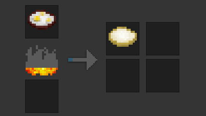
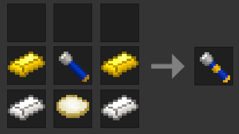
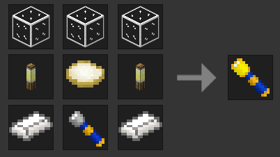
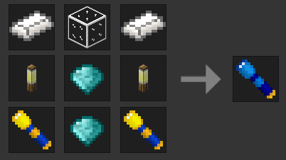

# Light Tool

This is a mod that adds a Torch/Flashlight to [Minetest](https://www.minetest.net/) ( [Github Repo](https://github.com/Minetest/minetest))

## Recipes for tiered flashlights

Enabled with the light_tool_max_tier setting.
You may want to adjust the active_block_range setting too.
For thicker light beams, adjust the light_tool_divergent_tools setting.

You will observe some delay in the light beams after 32 meters.
This is because map blocks beyond this range are not updated in real time.

First, you need some kind of reflector for your basic flashlight.
Coat a curved bronze disk with tin by putting them in a furnace:

Combine the reflector with a torch, some coal, a bronze housing, and a glass window, to make your first flashlight:

You may think “haha, I could just place a torch instead of holding this flashlight!”
To give it more range, add some iron components and wood, so your flashlight generates and burns wood gas:

Still not enough?
Okay, coat the reflector with some gold, so you get a really nice parabolic mirror:

Then put this mirror into your flashlight:

While you were mining for gold, you may have found a giant cave, where this flashlight still lacks power.
Well, there is a material called Mese, which you can find even deeper in the ground.
Build some light sources from Mese, and use them instead of the wood gas burner:

As you go deeper, the caves become even bigger?
Just build more flashlights, and combine their beams with some diamond lenses:

# Animated gif

Here's how it works

.gif)

The beam is obstructed by blocks and go through glass and other nodes (with sunlight_propagates = true)

Minetest forumn topic [here](https://forum.minetest.net/viewtopic.php?f=9&t=23031&p=354005#p354005)

# Technic

I have also added support for technic
But since I can't actually edit the mod itself
I have provided a file "flashlight.lua"
go into your technic mod at mods/technic/technic/tools/
and replace the existing flashlight.lua with the one I have provided
then go into the depends.txt and add light_tool
